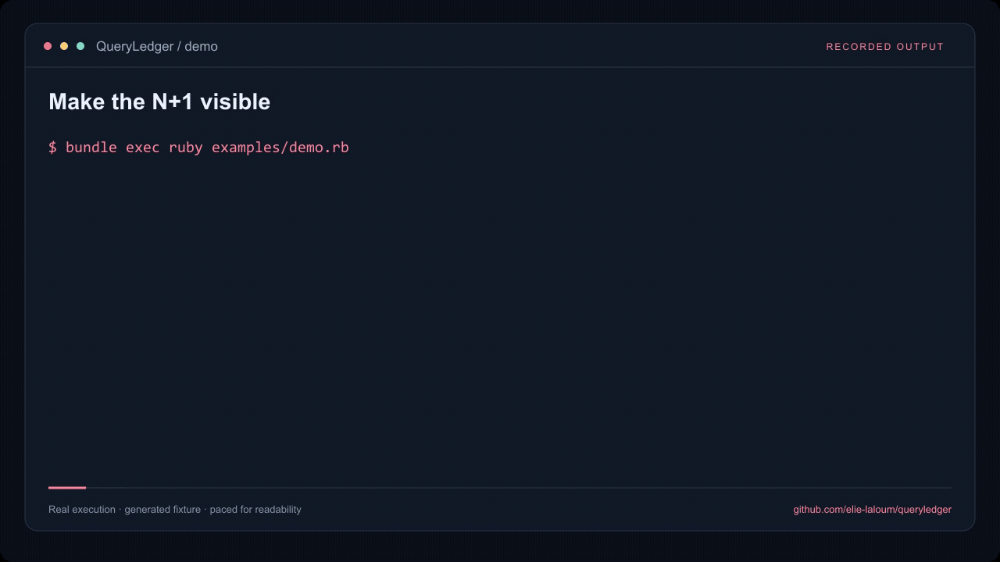

<p align="right"><a href="README.md">English</a></p>


<!-- project badges -->
<p>
<a href="README.md"></a>
<a href="https://github.com/elie-laloum/queryledger/actions/workflows/ci.yml"></a>
<a href="LICENSE"></a>
<a href="README.md#see-it-in-action"></a>
</p>
<p>
<a href="README.md#quick-start"></a>
<a href="README.md#quick-start"></a>
<a href="README.md#quick-start"></a>
</p>
<!-- /project badges -->

# QueryLedger

**Transformez le nombre de requêtes SQL en contrat de test explicite. Détectez un N+1 avant qu’il arrive en production.**

## Voir la démo

<a href="assets/demo.mp4"></a>

<sub>Démo réellement exécutée, rejouée avec des annotations et un rythme adapté à la lecture.</sub>

[Vidéo MP4](assets/demo.mp4) · [Reproduire la démo](docs/demo.md)

## Essayer la version 0.1

```sh
git clone https://github.com/elie-laloum/queryledger.git
cd queryledger
bundle install
bundle exec rake test
bundle exec ruby examples/demo.rb
```

L’exemple SQLite charge trois auteurs et leurs articles : quatre requêtes avec un chargement paresseux, deux après ajout de includes(:posts).

## Utilisation et périmètre

Capturez un bloc avec `QueryLedger.capture`, enregistrez le rapport, puis validez le budget avec `queryledger record --accept`. Le comparateur et le matcher RSpec échouent si le budget manque ou si le nombre de requêtes le dépasse. Les requêtes asynchrones ne sont pas comptées.

[Configuration complète et contrat de l’API](README.md#use-it-on-your-project) · [Limites détaillées](README.md#boundaries) · [Contribuer](CONTRIBUTING.md)

La documentation technique de référence est en anglais. Cette traduction présente le démarrage et le périmètre de la version actuelle.

[GitLab origin](https://gitlab.elielaloum.com/elielaloum/queryledger) · [GitHub mirror](https://github.com/elie-laloum/queryledger)

Le dépôt GitLab privé contient la source de référence ; GitHub en est le miroir public.
