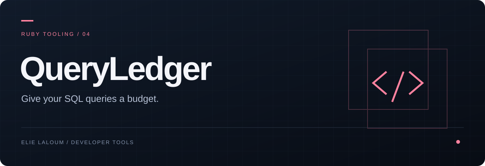

<p align="center"><a href="README.md">English</a> · <strong>Français</strong></p>

<p align="center"></p>

# QueryLedger

**Donnez un budget de requêtes à chaque endpoint Rails.**

Un projet de gem Ruby open source pour rendre les régressions SQL visibles dans les tests Rails et les revues de code.

> **En développement.** Ce dépôt contient la spécification et la documentation initiales. Aucune version exécutable n’est encore publiée.


**Dépôt d’origine : [GitLab](https://gitlab.elielaloum.com/elielaloum/queryledger)** · [Miroir public GitHub](https://github.com/elie-laloum/queryledger). Le dépôt GitLab est privé ; son accès nécessite une autorisation. Les modifications du code sont intégrées dans GitLab puis synchronisées vers GitHub.


## Rendez le coût SQL visible pendant la revue

Une petite modification peut ajouter du travail SQL à un endpoint très utilisé. QueryLedger doit comparer les comptes de requêtes à un budget versionné et montrer les familles de requêtes qui ont changé.

```text
Test de requête → Collecte SQL → Comparaison au budget → Explication de la régression
```

## Périmètre initial

- Applications Rails avec tests de requêtes RSpec.
- Collecte via l'événement Active Support `sql.active_record`.
- Budgets par exemple de test et référence explicitement revue.
- Empreintes SQL normalisées, différences de comptes et origines disponibles.
- Échec de test lisible et rapport exploitable par d'autres outils.

Commencer par les tests synchrones. Documenter le cache et les exclusions des requêtes de schéma et de transaction. Le temps SQL reste informatif au départ, car le bruit de l'environnement rend les seuils temporels moins reproductibles.

## Sa place dans votre workflow

[Bullet](https://github.com/flyerhzm/bullet) détecte déjà les N+1 et peut faire échouer les tests. QueryLedger vise un budget explicite et une comparaison à une référence examinable. Il doit compléter les outils de détection existants.

## La démonstration à livrer

Une petite application Rails, un budget respecté, une régression réelle, l'échec correspondant et la correction vérifiée. Chaque nombre affiché doit provenir de l'exécution enregistrée.

## Conditions de publication

Aucune mise à jour silencieuse de la référence. Exclure les valeurs SQL sensibles des rapports. Tester la détection, les exclusions et la matrice Ruby/Rails prise en charge. Documenter clairement que le travail asynchrone reste hors du périmètre initial.

## Contribuer au projet

Premières contributions utiles : tests de requêtes minimaux, vérification des adaptateurs et retours sur les rapports. Les instructions d'installation suivront une version vérifiée de la gem.


---

[Feuille de route](ROADMAP.md) · [Contribuer](CONTRIBUTING.md) · [Licence MIT](LICENSE)
